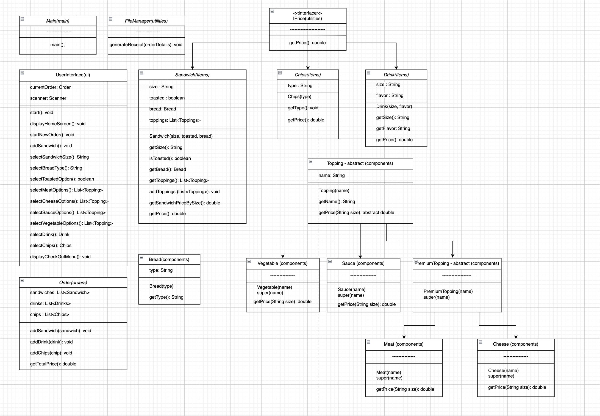
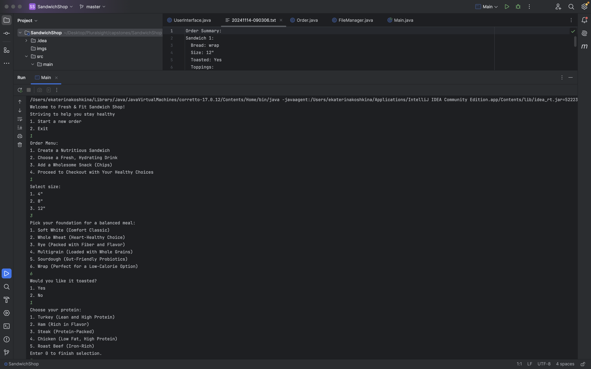
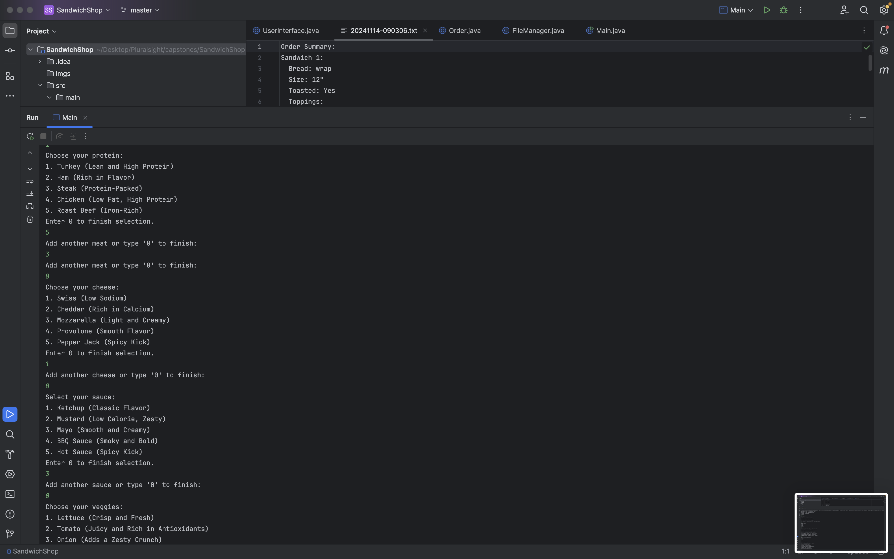
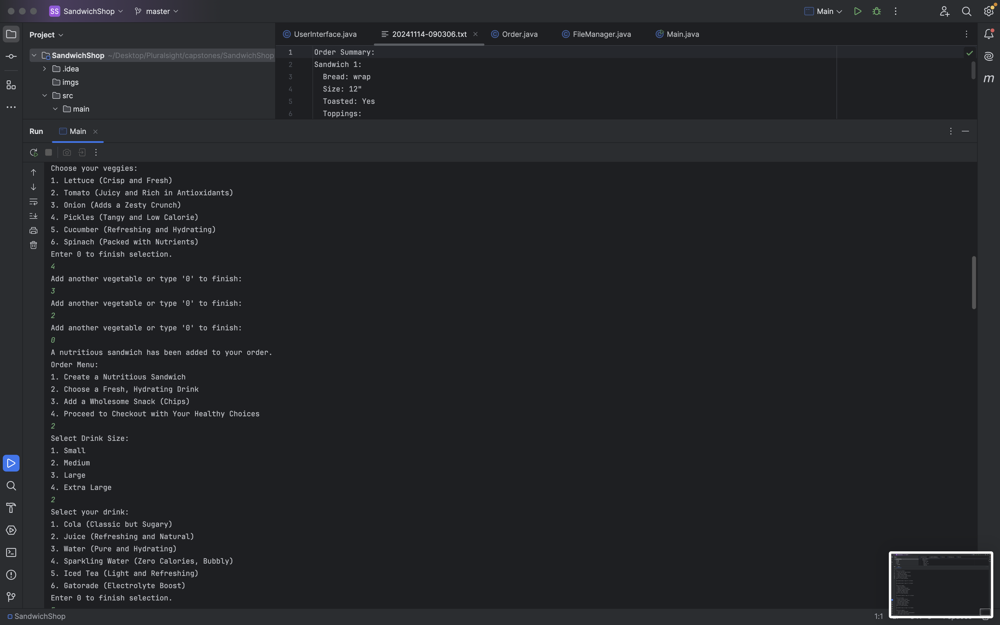
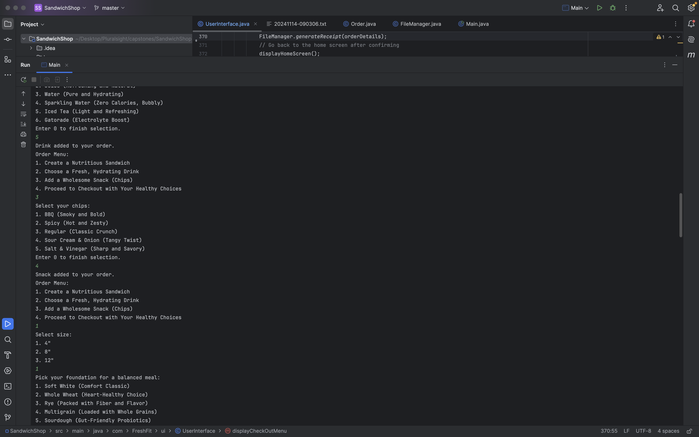
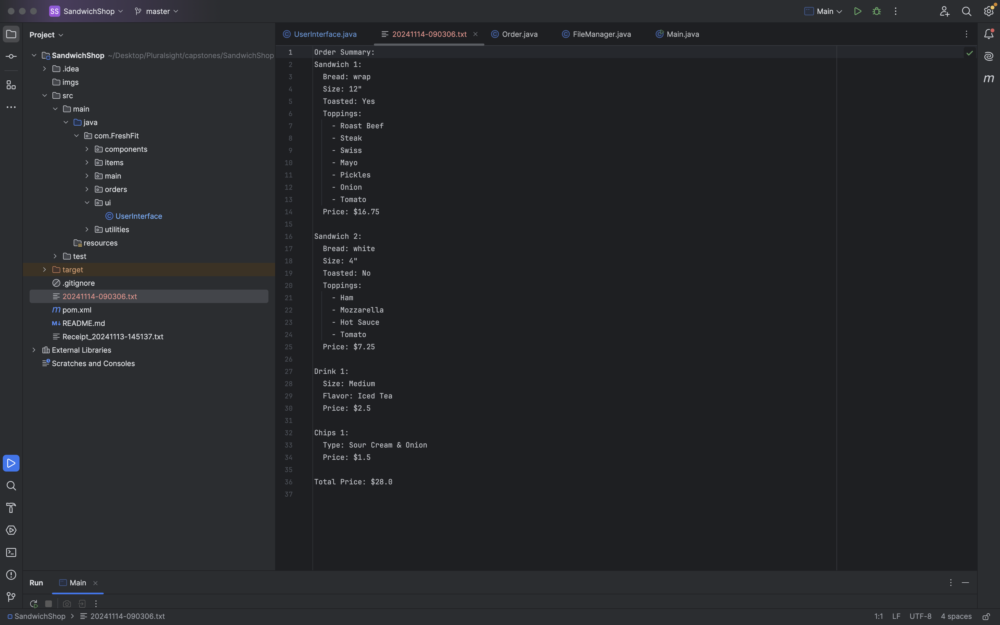

# Fresh & Fit Sandwich Shop Ordering Application

## Description of the Project

This Java console application is designed to streamline the ordering process for a customizable Fresh & Fit sandwich shop. The application allows users to build a sandwich order by selecting various ingredients, including bread types, toppings, and sauces, and also add drinks and chips. This tool is intended for both customers of a virtual deli and backend administrators who want a seamless way to handle custom orders. The application's purpose is to simplify order management, ensure accurate pricing, and provide a receipt of the final order.

**Class Diagram**

## User Stories

- As a user, I want to have an option to place an order so that I can start choosing items to purchase.
- As a user, I want to be able to pick between items like a sandwich, drink, and chips so that I can customize my order with the available options.
- As a user, I want to have the ability to customize my sandwich by selecting bread type, adding meat, cheese, and other toppings, and choosing sauces so that I can create a sandwich to my taste.
- As a user, I want the ability to get a receipt with the items so that I have a record of my order.

## Setup

Instructions on how to set up and run the project using IntelliJ IDEA.

### Prerequisites

- IntelliJ IDEA: Ensure you have IntelliJ IDEA installed, which you can download from [here](https://www.jetbrains.com/idea/download/).
- Java SDK: Make sure Java SDK is installed and configured in IntelliJ.

### Running the Application in IntelliJ

Follow these steps to get your application running within IntelliJ IDEA:

1. Open IntelliJ IDEA.
2. Select "Open" and navigate to the directory where you cloned or downloaded the project.
3. After the project opens, wait for IntelliJ to index the files and set up the project.
4. Find the main class with the `public static void main(String[] args)` method.
5. Right-click on the file and select 'Run 'YourMainClassName.main()'' to start the application.

## Technologies Used

- Java: Version 17
- IntelliJ IDEA: For development and execution.
- Draw.io: For creating Class Diagram

## Demo of the project

**Ordering a sandwich**

**Ordering a drink**

**Ordering chips**

**Order Summary (error handling)**

**Order Summary with conformation**

**Receipt**

## Future Work

Outline potential future enhancements or functionalities you might consider adding:

- GUI Implementation: Expand the console-based application into a graphical user interface.
- Discounts and Promotions: Include functionality for applying discounts or promotional offers.

## Resources

List resources such as tutorials, articles, or documentation that helped you during the project.

- [Draw.io Tutorial](https://drawio-app.com/tutorials/)
- [Switch Statement Improvement](https://stackoverflow.com/questions/5086322/java-switch-statement-multiple-cases)
- [Java Interface](https://www.youtube.com/watch?v=GhslBwrRsnw&t=35s)

## Thanks

Express gratitude towards those who provided help, guidance, or resources:

- Thank you to Raymond for continuous support and guidance.